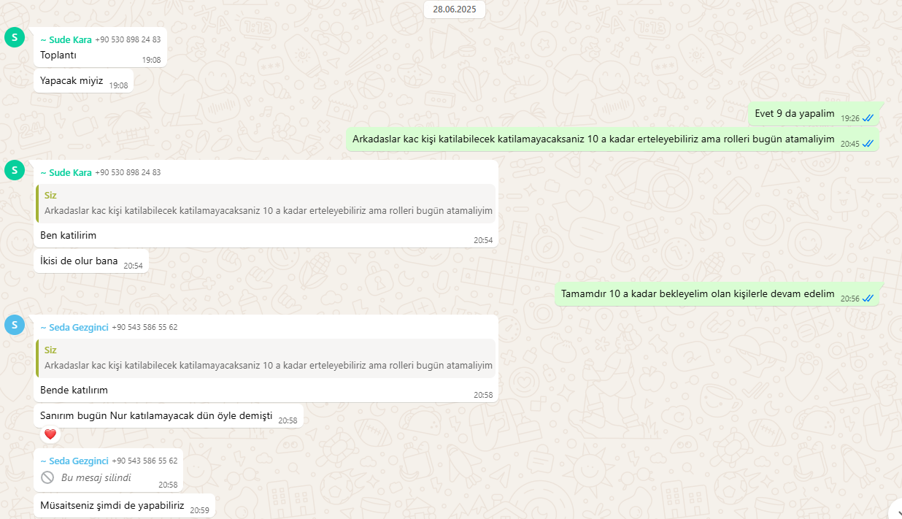
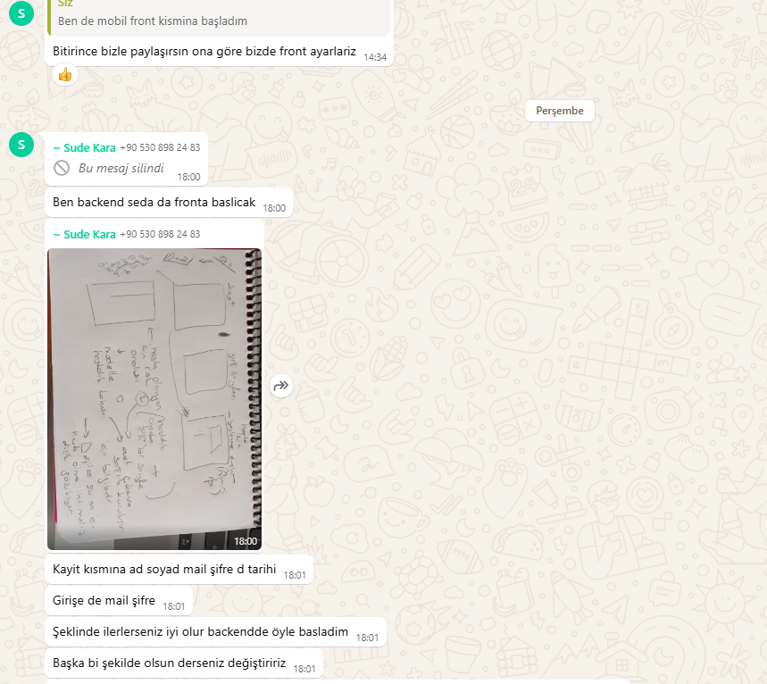

<html>
<body>

# **Takım & Proje İsmi**

### **`DiaScan`**

# Takım ve Ürün Hakkındaki Bilgiler

  ## Takım Üyeleri

  <table>
    <tr>
      <th>İsim</th>
      <th>Görev</th>
    </tr>
    <tr>
      <td>Mustafa İsmail Öztürk</td>
      <td>Scrum Master</td>
    </tr>
    <tr>
      <td>Seda Gezginci</td>
      <td>Product Owner</td>
    </tr>
    <tr>
      <td>Sude Kara</td>
      <td>Developer</td>
    </tr>
    <tr>
      <td>Nur Şahin</td>
      <td>Developer</td>
    </tr>
  
  </table>

  
  
  
  
  
  
  
  ## Ürün Açıklaması
  DiaScan, diyabet hastaları başta olmak üzere kronik hastalık riski taşıyan bireylerin tahlil sonuçlarına dayalı olarak kişisel sağlık risklerini değerlendiren gelişmiş bir dijital sağlık uygulamasıdır. Yapay zeka destekli veri seti ve analiz motoruyla, bireylerin diyabet ve kalp krizi gibi kritik sağlık sorunlarına yönelik risk profillerini bilimsel yöntemlerle tahmin eder ve önleyici adımlar konusunda farkındalık yaratır. Kullanıcıya özel oluşturulan sağlık risk raporuna göre gerekli tedavi adımlarını açıklayarak yerel sağlık kuruluşlarına yönlendirilmesi sağlar.

  

    
<h3>Ürün Özellikleri</h3>

  <h2>Akıllı Tahlil Verisi Analizi:</h2>
    
Kan şekeri, HbA1c, kolesterol düzeyleri, tansiyon gibi medikal tahlil sonuçlarını detaylı analiz eder.

  <h2>Hastalık Risk Skoru Hesaplama:</h2>
    
Yapay zeka algoritmaları ile kalp krizi, felç, böbrek yetmezliği gibi komplikasyonlara yönelik kişisel risk skorları üretir.

  <h2>Zaman İçinde Değişim Takibi:</h2>
    
Kullanıcının düzenli sağlık verilerini kıyaslayarak, risk faktörlerindeki olumlu ya da olumsuz gelişmeleri gösterir.

  <h2>Öneri ve Uyarı Sistemi:</h2>
    
Risk seviyesi yüksek çıktığında kullanıcıyı bilgilendirir ve yaşam tarzı değişikliği, doktor görüşmesi gibi önerilerde bulunur.

  <h2>Güvenli Veri Saklama ve Gizlilik:</h2>
    
Sağlık verileri şifreli olarak saklanır ve kullanıcı onayı olmadan üçüncü kişilerle paylaşılmaz.

  

  

    
<h3>Hedef Kitle</h3>

    
DiaScan, sağlık verilerini bilinçli şekilde yönetmek isteyen bireyler için geliştirilmiş kapsamlı bir analiz uygulamasıdır. Özellikle Tip 1 ve Tip 2 diyabet hastalarının kan şekeri, HbA1c gibi değerlerini takip ederek hastalıklarını daha iyi yönetmelerine yardımcı olurken, kalp krizi ve böbrek yetmezliği gibi komplikasyonlara karşı kişiye özel risk skorları sunar. Ailesinde kronik hastalık öyküsü bulunan ya da yaşam tarzı nedeniyle risk altında olduğunu düşünen bireyler için erken uyarı sistemiyle önemli bir rehberdir. Henüz tanı konulmamış ancak sağlık verilerini yorumlamakta zorlanan bireyler de tahlil sonuçlarını sade ve anlaşılır grafiklerle değerlendirme fırsatı bulur. Sağlık profesyonelleri ise hastalarının verilerini daha etkin izleyebilir ve risk analizlerini dijital ortamda hastalarıyla paylaşarak danışan takibini kolaylaştırabilir. Kısacası, ister mevcut bir rahatsızlığı olsun, ister sağlığını koruma bilinciyle hareket eden biri olsun, DiaScan herkesin sağlık yönetiminde bilinçli adımlar atmasını destekleyen güvenilir bir yol arkadaşıdır.

  

  --- 

  

    
<h1>Sprint 1</h1>

  

    
<h3>Sprint 1 - Google Collab Link</h3>

  <table style="width: 100%;">
    <tr>
      <td colspan="4" style="text-align: center;"></td>
  </table>
  

  

    
<h3>Sprint 1 - Daily Scrum</h3>

  <table style="width: 100%;">
    <tr>
      <td colspan="1" style="width: 25%;"></td>
    </tr>
    <tr>
      <td colspan="4"></td>
    </tr>
    <tr>
      <td colspan="4"></td>
    </tr>
    <tr>
      <td colspan="4"></td>
    </tr>
  </table>
  

**Sprint Notları**:

    - Daily Scrum toplantılarını yapmak için 'Google Meet' tercih edildi.
    
    - Veri setlerini düzenlemek ve eğitmek için 'Google Collab' tercih edildi.

    - Proje yönetimi için 'Jira' programı tercih edildi.

    - UI dizaynı için 'Figma' programı tercih edildi.

    - Web ve mobil platform tercih edildi.

    - Mobil geliştirme için Flutter tercih edildi. 

    - Uygulama veri tabanı için 'Firebase' tercih edildi.
    
  - **Sprint için Belirlenen Toplam Puan**: 120 puan
  - **Tamamlanan Puan**: `(120 puan tamamlandı)`
  - **Sprint Tamamlama Mantığı**: Sprint görevleri ekip içinde eşit şekilde dağıtıldı ve her bir görev 20 puan olmak üzere toplam 6 görev tamamlandı.
  
  - **Sprint Review:**
    - Birinci Sprint için ağırlıklı olarak veri setleri üzerine çalıştık.
    - Kaggle üzerinden diyabet hastalarının kan analizi verileri içeren veri setleri bulduk.
    - Yeteneklerimize göre kod yazma, tasarım ve makine öğrenimi kısımlarının kimde olması gerektiğine karar verdik.
    - Sprint için 2 görev belirledik ve yaşanan tüm aksaklıklara rağmen başarılı şekilde tüm görevleri tamamladık.
    - Projemizin hedef kitlesini ve çalışma mantığını net şekilde belirledik.
  
  - **Sprint Retrospective:**
    - İkinci Sprint için ağırlıklı olarak web ve uygulama tasarımı üzerine çalışmaya karar verdik .
    - Daily Scrum toplantıları sürekli aksıyor, saatlerimizi müsaitlik durumlarına göre düzenlemeliyiz
    - Kod yazamayanların iş yükünü takım içinde daha dengeli paylaştırmalıyız.
 

 

    
<h1>Sprint 2</h1>

  

    
<h3>Sprint 1 - Miro Board Screen Shots</h3>

  <table style="width: 100%;">
    <tr>
      <td colspan="1" style="width: 25%;"></td>
    </tr>
    <tr>
      <td colspan="4"></td>
    </tr>
  </table>
  

  

    
<h3>Sprint 1 - Daily Scrum Screen Shots</h3>

  <table style="width: 100%;">
    <tr>
      <td colspan="1" style="width: 25%;"></td>
    </tr>
    <tr>
      <td colspan="4"></td>
    </tr>
    <tr>
      <td colspan="4"></td>
    </tr>
  </table>
  

**Sprint Notları**:

    - Diyabet hastalığının modeli geliştirilmiştir.
    
    - Hastanın Pedigree değeri direkt değer olarak alınamayacağından pedigree için ayriyeten bir model kurulmuştur.

    - Ürünün mobil uygulaması için Flutter’dan çalışmalara başlanmıştır.

    - Ürünün web sitesi için çalışmalara başlanmıştır.
    
    
  - **Sprint için Belirlenen Toplam Puan**: 100 puan
  - **Tamamlanan Puan**: `(100 puan tamamlandı)`
  - **Sprint Tamamlama Mantığı**: Sprint görevleri ekip içinde eşit şekilde dağıtıldı ve her bir görev 20 puan olmak üzere toplam 5 görev tamamlandı.
  
  - **Sprint Review:**
    - İkinci sprint için ağırlıklı yapay zeka modeli geliştirilmesi için çalışıldı.
    - Birinci sprinte göre ekip halinde daha aktif çalışıldı.
    - Bir üye iletişimi kesti ve 4 kişi kaldık.
    - Web ve mobil için frontend çalışmalarına başlandı.
  
  - **Sprint Retrospective:**
    - Üçüncü Sprint için ağırlıklı olarak web ve uygulama tasarımı üzerine çalışmaya karar verdik .
    - Daily Scrum toplantıları artık aksamıyor, daha çok yazılı olarak iletişim kuruyoruz.
    - Artık backend geliştirmeye başlamalıyız.
 

  ---

  

